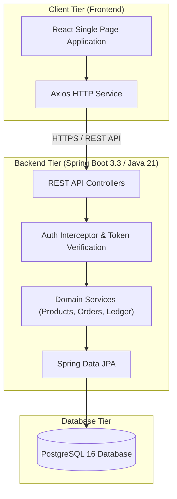
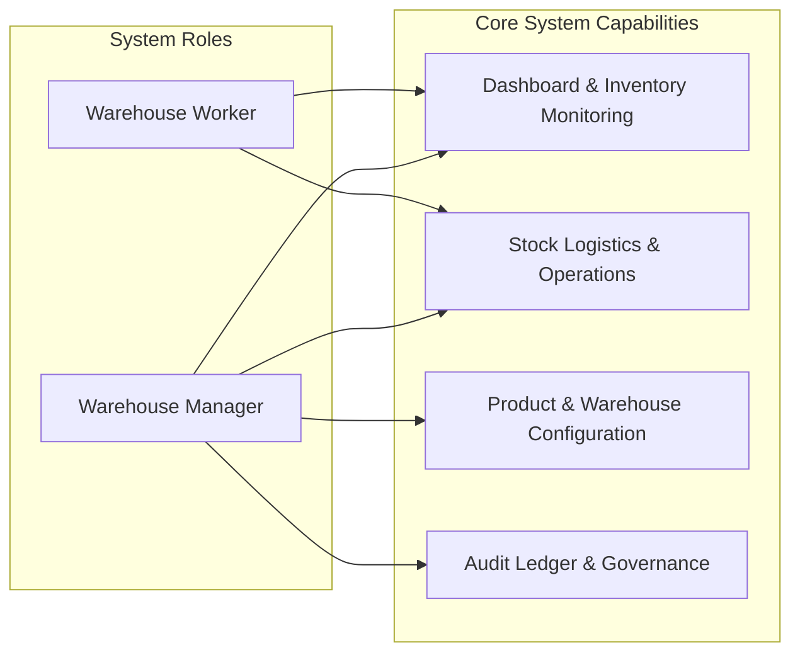

# StockSense - Enterprise Inventory Management System

StockSense is a robust, full-stack Enterprise Inventory Management System designed to provide real-time inventory tracking, multi-warehouse operational management, double-entry stock ledger auditing, and automated replenishment workflows.

Built with Java 21, Spring Boot 3.3.4, PostgreSQL, and React with TypeScript, StockSense provides enterprise-grade scalability, immutable inventory event tracking, and intuitive user workflows for warehouse managers and operational staff.


---

## Table of Contents

- [System Architecture](#system-architecture)
- [Use Case & Role Modeling](#use-case--role-modeling)
- [Core Features](#core-features)
- [Technology Stack](#technology-stack)
- [Project Directory Structure](#project-directory-structure)
- [Data Integrity & Stock Ledger Model](#data-integrity--stock-ledger-model)
- [Getting Started](#getting-started)
  - [Prerequisites](#prerequisites)
  - [Database Setup with Docker](#database-setup-with-docker)
  - [Backend Setup](#backend-setup)
  - [Frontend Setup](#frontend-setup)
- [REST API Reference](#rest-api-reference)
- [Security & Authentication](#security--authentication)

---

## System Architecture

StockSense follows a multi-tier decoupled architecture with a React Single-Page Application (SPA) frontend, a Spring Boot RESTful API backend layer, and a PostgreSQL relational database tier with dedicated immutability constraints for transaction ledgers.



---

## Use Case & Role Modeling

The system establishes strict Role-Based Access Control (RBAC) separating administrative warehouse management functions from day-to-day warehouse operations.



### Role Capabilities Summary

- **Warehouse Manager (`MANAGER`)**: Full system administrative capabilities including worker account approvals, product creation and metadata updates, warehouse location structure configuration, inventory reconciliation approvals, and unrestricted access to historical double-entry audit ledgers.
- **Warehouse Worker (`WORKER`)**: Day-to-day operational execution capabilities including account registration and email OTP validation, receiving incoming supplier receipts, picking and validating outbound delivery orders, transferring inventory across internal locations, and recording physical stock count adjustments.

---

## Core Features

1. **Real-Time Analytics & Dashboard**: Instant metrics on total inventory valuation, active SKU counts, low stock alerts, pending receipt orders, and pending delivery orders.
2. **Product & SKU Catalog Management**: Maintain detailed product records with custom category classification, units of measure, minimum reorder thresholds, and pricing attributes.
3. **Multi-Warehouse & Storage Location Hierarchy**: Multi-tenant warehouse capabilities supporting internal storage zones, racks, vendor locations, customer locations, and inventory loss locations.
4. **Receipt Orders (Inbound Logistics)**: Complete workflow for tracking supplier deliveries from draft state to validation and physical stock placement.
5. **Delivery Orders (Outbound Logistics)**: Streamlined customer order fulfillment with automated reservation checking and stock validation prior to dispatch.
6. **Internal Stock Transfers**: Seamless movement of goods across internal storage locations with state transitions (Draft, In-Transit, Completed).
7. **Physical Stock Adjustments**: Comprehensive inventory counting mechanisms with auto-calculated variance handling and stock reconciliation.
8. **Double-Entry Audit Ledger**: Every inventory adjustment, receipt, delivery, or transfer generates an immutable, timestamped record preserving balance trace history.
9. **Authentication & Password Recovery**: Secure authentication layer with BCrypt password hashing, session tokens, and automated email password reset triggers.

---

## Technology Stack

### Backend
- **Framework**: Spring Boot 3.3.4
- **Language**: Java 21
- **Persistence**: Spring Data JPA / Hibernate
- **Database**: PostgreSQL 16 (Runtime) / H2 (Testing)
- **Security & Crypto**: Spring Security Crypto (BCrypt password encoder)
- **Email Notifications**: Spring Boot Mail / JavaMail

### Frontend
- **Framework**: React 18.3
- **Language**: TypeScript 5.6
- **Build Tool**: Vite 5.4
- **HTTP Client**: Axios 1.7
- **Iconography**: Lucide React
- **Routing & State**: React Router DOM 7, Custom React Hooks & Context

### Infrastructure & Operations
- **Containerization**: Docker & Docker Compose
- **Database Container**: PostgreSQL 16 Alpine

---

## Project Directory Structure

```
StockSense/
├── docker-compose.yml              # PostgreSQL database container orchestration
├── README.md                       # Comprehensive system documentation
├── backend/                        # Spring Boot REST API application
│   ├── pom.xml                     # Maven project configuration & dependencies
│   ├── mvnw / mvnw.cmd             # Cross-platform Maven wrappers
│   └── src/
│       ├── main/
│       │   ├── java/com/stocksense/
│       │   │   ├── StockSenseApplication.java
│       │   │   ├── auth/           # Authentication, User entity & Security Interceptors
│       │   │   ├── common/         # Global exception handling & response utilities
│       │   │   ├── config/         # Cors & Web MVC application configurations
│       │   │   ├── dashboard/      # KPI aggregation services & endpoints
│       │   │   ├── inventory/      # Aggregate stock balance models
│       │   │   ├── ledger/         # Immutable audit trail ledger models & logic
│       │   │   ├── operation/      # Stock adjustment operations & variance logic
│       │   │   ├── order/          # Receipt & Delivery order domain workflows
│       │   │   ├── product/        # SKU management & reorder alert engines
│       │   │   ├── transfer/       # Internal location transfer services
│       │   │   └── warehouse/      # Warehouse & location hierarchy domain models
│       │   └── resources/
│       │       └── application.properties # Spring database & mail configurations
│       └── test/                   # Automated unit & integration tests
└── frontend/                       # React + TypeScript single-page application
    ├── package.json                # Frontend package metadata & script definitions
    ├── vite.config.ts              # Vite build tool configuration
    ├── tsconfig.json               # TypeScript compiler flags
    └── src/
        ├── App.tsx                 # Main application root component & session gate
        ├── main.tsx                # Client DOM entrypoint
        ├── api/                    # Modular Axios HTTP client API instances
        ├── components/             # Reusable UI widgets, forms, headers & sidebars
        ├── hooks/                  # Custom React hooks (toast, state, session)
        ├── pages/                  # Page route view components
        ├── styles/                 # Application design tokens & global CSS
        └── types/                  # TypeScript interfaces and domain type definitions
```

---

## Data Integrity & Stock Ledger Model

StockSense follows **double-entry principles for inventory management** to maintain accurate, consistent, and auditable stock records.

- **Immutability**: Stock ledger entries cannot be modified or deleted once persisted. Any correction is recorded through a new offsetting adjustment entry, preserving the original transaction history.

- **Atomic State Modifications**: Inventory-changing operations are executed within transactional boundaries using Spring's `@Transactional`. If any step in a transfer, receipt, delivery, or adjustment fails, the associated inventory and ledger changes are rolled back to maintain data consistency.

- **Traceability**: Every inventory movement records essential information such as the product/SKU, source location, destination location, reference order, operating user, quantity, timestamp, and resulting inventory balance.

- **Auditability**: All stock movements are recorded in the ledger, providing a complete historical trail for inventory reconciliation, operational monitoring, and audit purposes.

- **Consistency**: Inventory balances and corresponding ledger entries are updated together, ensuring that stock quantities remain synchronized with their transaction history.

---

## Getting Started

### Prerequisites

Ensure you have the following installed on your host system:
- Java Development Kit (JDK) 21 or higher
- Node.js 18+ and npm
- Docker Desktop or Docker Engine with Docker Compose

### Database Setup with Docker

1. Navigate to the project root directory:
   ```bash
   cd StockSense
   ```

2. Start the PostgreSQL database container:
   ```bash
   docker-compose up -d
   ```
   This initializes a PostgreSQL 16 container exposed on port `5432` with database `stocksense`.

### Backend Setup

1. Navigate to the backend directory:
   ```bash
   cd backend
   ```

2. Run the Spring Boot application using Maven:
   ```bash
   # On Windows PowerShell / Command Prompt
   .\mvnw.cmd spring-boot:run

   # On Linux / macOS
   ./mvnw spring-boot:run
   ```

3. The REST API backend will start on `http://localhost:8080`.

### Frontend Setup

1. Open a new terminal window and navigate to the frontend directory:
   ```bash
   cd frontend
   ```

2. Install npm dependencies:
   ```bash
   npm install
   ```

3. Start the Vite development server:
   ```bash
   npm run dev
   ```

4. Open your browser and navigate to `http://localhost:5173` to access the application.

---

## REST API Reference

| Endpoint Domain | HTTP Method | Path | Description | Access Level |
| :--- | :--- | :--- | :--- | :--- |
| **Authentication** | POST | `/api/auth/register` | Register new user account | Public |
| **Authentication** | POST | `/api/auth/login` | Authenticate and obtain token | Public |
| **Authentication** | GET | `/api/auth/me` | Fetch authenticated user profile | Authenticated |
| **Dashboard** | GET | `/api/dashboard/kpis` | Retrieve high-level inventory KPIs | Authenticated |
| **Products** | GET | `/api/products` | Search and filter product catalog | Authenticated |
| **Products** | POST | `/api/products` | Create a new SKU / product | Manager |
| **Products** | PUT | `/api/products/{id}` | Update existing product details | Manager |
| **Warehouses** | GET | `/api/warehouses` | List warehouses & sub-locations | Authenticated |
| **Warehouses** | POST | `/api/warehouses` | Create warehouse entry | Manager |
| **Receipts** | GET | `/api/receipts` | List inbound receipt orders | Authenticated |
| **Receipts** | POST | `/api/receipts` | Create inbound receipt draft | Authenticated |
| **Receipts** | POST | `/api/receipts/{id}/validate` | Validate receipt and post stock | Authenticated |
| **Deliveries** | GET | `/api/deliveries` | List outbound delivery orders | Authenticated |
| **Deliveries** | POST | `/api/deliveries/{id}/validate` | Validate delivery and decrement stock | Authenticated |
| **Transfers** | POST | `/api/transfers` | Execute internal stock transfer | Authenticated |
| **Adjustments** | POST | `/api/operations/adjust` | Record stock count adjustment | Authenticated |
| **Ledger** | GET | `/api/ledger` | Query stock movement audit trail | Manager |

---

## Security & Authentication

- **Password Hashing**: User passwords are encrypted using BCrypt standard algorithm before database insertion.
- **Session Protection**: API requests are validated via custom HTTP header token interception (`AuthInterceptor`).
- **Input Sanitization**: Request payloads undergo server-side bean validation (`@Valid`, `@NotNull`, `@Min`) to block malicious payloads.
