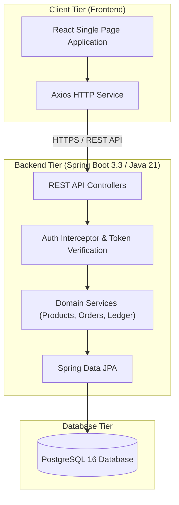
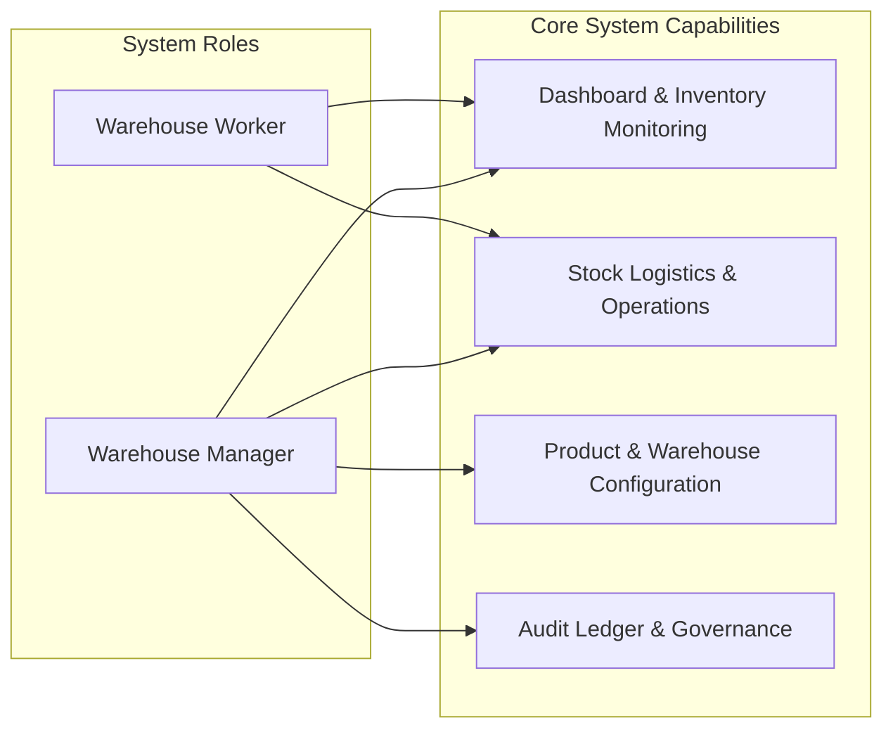

# StockSense

StockSense is an enterprise-grade Inventory and Warehouse Operations management system. 

It provides a modern, responsive web application for managing stock levels, processing orders, and providing administrative oversight to your operations.

## Architecture

StockSense is built as a full-stack web application:

## Table of Contents

- [System Architecture](#system-architecture)
- [Use Case & Role Modeling](#use-case--role-modeling)
- [Core Features](#core-features)
- [Technology Stack](#technology-stack)
- [Project Directory Structure](#project-directory-structure)
- [Data Integrity & Stock Ledger Model](#data-integrity--stock-ledger-model)
- [Getting Started](#getting-started)
  - [Prerequisites](#prerequisites)
  - [Database Setup with Docker](#database-setup-with-docker)
  - [Backend Setup](#backend-setup)
  - [Frontend Setup](#frontend-setup)
- [REST API Reference](#rest-api-reference)
- [Security & Authentication](#security--authentication)

---

## System Architecture

StockSense is designed using a multi-tier, decoupled architecture that separates the user interface, business logic, and data management into independent layers. This structure enables maintainability, scalability, secure communication, and reliable inventory operations.

The system consists of three primary layers: a React-based frontend for user interaction, a Spring Boot REST API backend for authentication and business logic, and a PostgreSQL database for persistent storage and immutable inventory ledger management.

This architecture ensures that inventory operations such as receipts, deliveries, transfers, and adjustments are processed consistently while maintaining complete traceability of stock movements.



---

## Use Case & Role Modeling

The system establishes strict Role-Based Access Control (RBAC) separating administrative warehouse management functions from day-to-day warehouse operations.



### Role Capabilities Summary

- **Warehouse Manager (`MANAGER`)**: Full system administrative capabilities including worker account approvals, product creation and metadata updates, warehouse location structure configuration, inventory reconciliation approvals, and unrestricted access to historical double-entry audit ledgers.
- **Warehouse Worker (`WORKER`)**: Day-to-day operational execution capabilities including account registration and email OTP validation, receiving incoming supplier receipts, picking and validating outbound delivery orders, transferring inventory across internal locations, and recording physical stock count adjustments.

---

## Core Features

1. **Real-Time Analytics & Dashboard**: Instant metrics on total inventory valuation, active SKU counts, low stock alerts, pending receipt orders, and pending delivery orders.
2. **Product & SKU Catalog Management**: Maintain detailed product records with custom category classification, units of measure, minimum reorder thresholds, and pricing attributes.
3. **Multi-Warehouse & Storage Location Hierarchy**: Multi-tenant warehouse capabilities supporting internal storage zones, racks, vendor locations, customer locations, and inventory loss locations.
4. **Receipt Orders (Inbound Logistics)**: Complete workflow for tracking supplier deliveries from draft state to validation and physical stock placement.
5. **Delivery Orders (Outbound Logistics)**: Streamlined customer order fulfillment with automated reservation checking and stock validation prior to dispatch.
6. **Internal Stock Transfers**: Seamless movement of goods across internal storage locations with state transitions (Draft, In-Transit, Completed).
7. **Physical Stock Adjustments**: Comprehensive inventory counting mechanisms with auto-calculated variance handling and stock reconciliation.
8. **Double-Entry Audit Ledger**: Every inventory adjustment, receipt, delivery, or transfer generates an immutable, timestamped record preserving balance trace history.
9. **Authentication & Password Recovery**: Secure authentication layer with BCrypt password hashing, session tokens, and automated email password reset triggers.

---

## Technology Stack

### Backend

- **Programming Language**: Java 21
- **Framework**: Spring Boot 3.3.4
- **Persistence Layer**: Spring Data JPA / Hibernate
- **Database**: PostgreSQL 16
- **Testing Database**: H2
- **Security**: Spring Security Crypto
- **Password Hashing**: BCrypt
- **Email Services**: Spring Boot Mail / JavaMail
- **API Architecture**: RESTful APIs
- **Transaction Management**: Spring `@Transactional`

### Frontend

- **Framework**: React 18.3
- **Programming Language**: TypeScript 5.6
- **Build Tool**: Vite 5.4
- **HTTP Client**: Axios 1.7
- **Routing**: React Router DOM 7
- **State Management**: React Hooks & Context API
- **UI Icons**: Lucide React
- **Architecture**: Single Page Application (SPA)

### Database & Infrastructure

- **Database**: PostgreSQL 16
- **Database Testing**: H2
- **Containerization**: Docker
- **Container Orchestration**: Docker Compose
- **Database Container**: PostgreSQL 16 Alpine

### Development & Testing

- **Build & Dependency Management**: Maven
- **Backend Testing**: JUnit / Spring Boot Test
- **Frontend Package Management**: npm
- **API Communication**: REST over HTTP/HTTPS
  
### Infrastructure & Operations

- **Containerization**: Docker & Docker Compose
- **Database Container**: PostgreSQL 16 Alpine

---

## Project Directory Structure

```
StockSense/
├── docker-compose.yml              # PostgreSQL database container orchestration
├── README.md                       # Comprehensive system documentation
├── backend/                        # Spring Boot REST API application
│   ├── pom.xml                     # Maven project configuration & dependencies
│   ├── mvnw / mvnw.cmd             # Cross-platform Maven wrappers
│   └── src/
│       ├── main/
│       │   ├── java/com/stocksense/
│       │   │   ├── StockSenseApplication.java
│       │   │   ├── auth/           # Authentication, User entity & Security Interceptors
│       │   │   ├── common/         # Global exception handling & response utilities
│       │   │   ├── config/         # Cors & Web MVC application configurations
│       │   │   ├── dashboard/      # KPI aggregation services & endpoints
│       │   │   ├── inventory/      # Aggregate stock balance models
│       │   │   ├── ledger/         # Immutable audit trail ledger models & logic
│       │   │   ├── operation/      # Stock adjustment operations & variance logic
│       │   │   ├── order/          # Receipt & Delivery order domain workflows
│       │   │   ├── product/        # SKU management & reorder alert engines
│       │   │   ├── transfer/       # Internal location transfer services
│       │   │   └── warehouse/      # Warehouse & location hierarchy domain models
│       │   └── resources/
│       │       └── application.properties # Spring database & mail configurations
│       └── test/                   # Automated unit & integration tests
└── frontend/                       # React + TypeScript single-page application
    ├── package.json                # Frontend package metadata & script definitions
    ├── vite.config.ts              # Vite build tool configuration
    ├── tsconfig.json               # TypeScript compiler flags
    └── src/
        ├── App.tsx                 # Main application root component & session gate
        ├── main.tsx                # Client DOM entrypoint
        ├── api/                    # Modular Axios HTTP client API instances
        ├── components/             # Reusable UI widgets, forms, headers & sidebars
        ├── hooks/                  # Custom React hooks (toast, state, session)
        ├── pages/                  # Page route view components
        ├── styles/                 # Application design tokens & global CSS
        └── types/                  # TypeScript interfaces and domain type definitions
```

---

## Data Integrity & Stock Ledger Model

StockSense follows **double-entry principles for inventory management** to maintain accurate, consistent, and auditable stock records.

- **Immutability**: Stock ledger entries cannot be modified or deleted once persisted. Any correction is recorded through a new offsetting adjustment entry, preserving the original transaction history.

- **Atomic State Modifications**: Inventory-changing operations are executed within transactional boundaries using Spring's `@Transactional`. If any step in a transfer, receipt, delivery, or adjustment fails, the associated inventory and ledger changes are rolled back to maintain data consistency.

- **Traceability**: Every inventory movement records essential information such as the product/SKU, source location, destination location, reference order, operating user, quantity, timestamp, and resulting inventory balance.

- **Auditability**: All stock movements are recorded in the ledger, providing a complete historical trail for inventory reconciliation, operational monitoring, and audit purposes.

- **Consistency**: Inventory balances and corresponding ledger entries are updated together, ensuring that stock quantities remain synchronized with their transaction history.

---

## Getting Started

### Prerequisites

- Node.js (v18+)
- Java (JDK 21+)
- Docker and Docker Compose
- Maven

### Setting Up the Environment

1. Clone the repository.
2. Copy the `.env.example` file to `.env` and fill in your specific configurations (like your SMTP credentials for email delivery).
3. Start the Postgres database:
   ```sh
   docker-compose up -d
   ```

### Running the Backend

The backend can be started using the provided bash script:
```sh
bash run-backend.sh
```

This will run the Spring Boot application on port 8080. It will automatically load the `.env` file if it is present.

### Running the Frontend

Navigate to the `frontend` directory, install the dependencies, and start the development server:

```sh
cd frontend
npm install
npm run dev
```

The frontend will usually run on port 5173 and communicate with the backend API on port 8080.

## License

This project is licensed under the MIT License.
